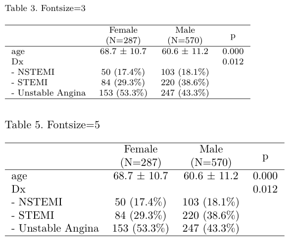
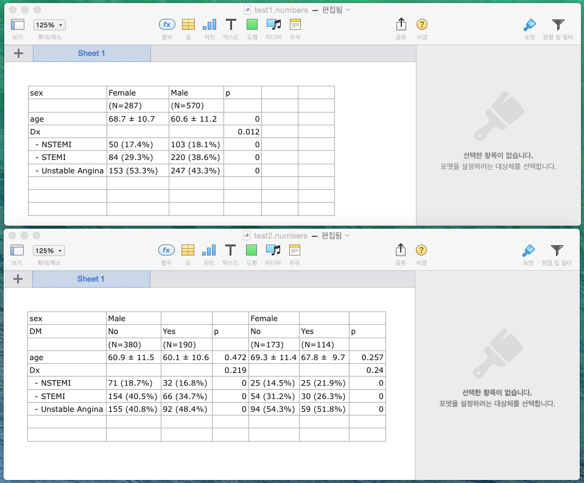
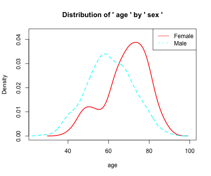
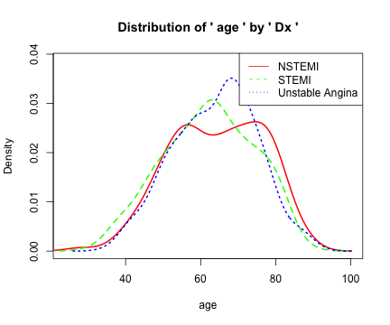
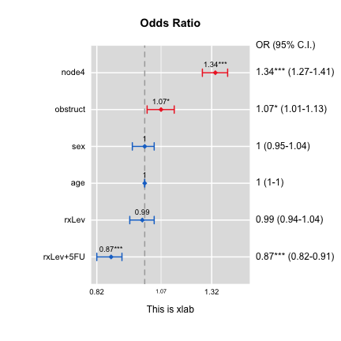
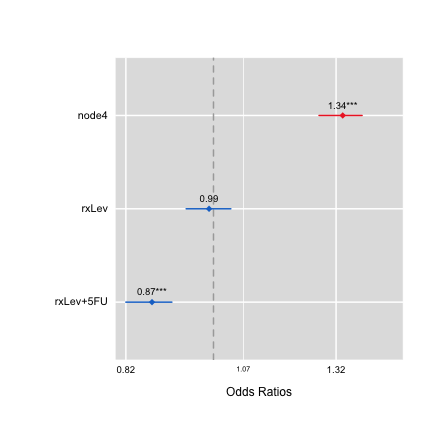
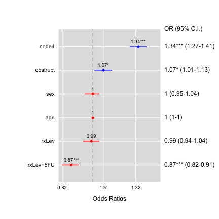
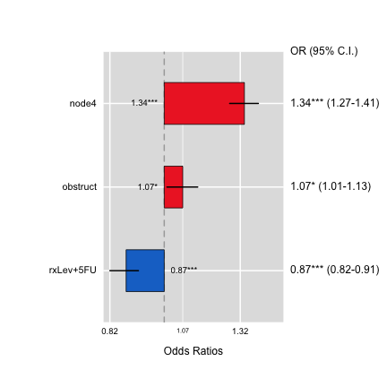
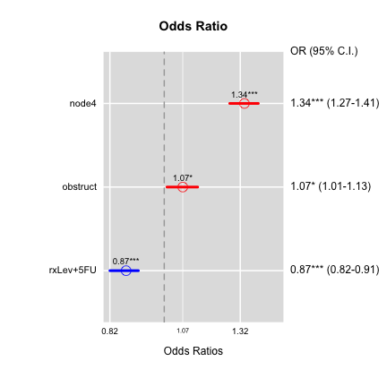
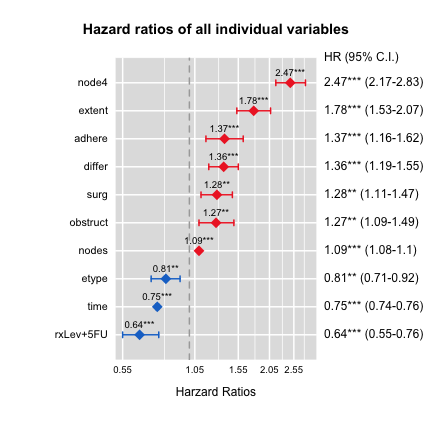

## Function "mytable"

Function "mytable"" produce table for descriptive analysis easily. It is most useful to make table to describe baseline charateristics common in medical research papers. 

## Basic Usage


```r
require(moonBook)
data(acs)
mytable(Dx~.,data=acs)
```

```

                 Descriptive Statistics by 'Dx'                 
_________________________________________________________________ 
                     NSTEMI       STEMI     Unstable Angina   p  
                    (N=153)      (N=304)        (N=400)    
----------------------------------------------------------------- 
 age              64.3 ± 12.3  62.1 ± 12.1    63.8 ± 11.0   0.073
 sex                                                        0.012
   - Female        50 (32.7%)   84 (27.6%)    153 (38.2%)        
   - Male         103 (67.3%)  220 (72.4%)    247 (61.8%)        
 cardiogenicShock                                           0.000
   - No           149 (97.4%)  256 (84.2%)   400 (100.0%)        
   - Yes           4 ( 2.6%)    48 (15.8%)     0 ( 0.0%)         
 entry                                                      0.001
   - Femoral       58 (37.9%)  133 (43.8%)    121 (30.2%)        
   - Radial        95 (62.1%)  171 (56.2%)    279 (69.8%)        
 EF               55.0 ±  9.3  52.4 ±  9.5    59.2 ±  8.7   0.000
 height           163.3 ±  8.2 165.1 ±  8.2  161.7 ±  9.7   0.000
 weight           64.3 ± 10.2  65.7 ± 11.6    64.5 ± 11.6   0.361
 BMI              24.1 ±  3.2  24.0 ±  3.3    24.6 ±  3.4   0.064
 obesity                                                    0.186
   - No           106 (69.3%)  209 (68.8%)    252 (63.0%)        
   - Yes           47 (30.7%)   95 (31.2%)    148 (37.0%)        
 TC               193.7 ± 53.6 183.2 ± 43.4  183.5 ± 48.3   0.057
 LDLC             126.1 ± 44.7 116.7 ± 39.5  112.9 ± 40.4   0.004
 HDLC             38.9 ± 11.9  38.5 ± 11.0    37.8 ± 10.9   0.501
 TG               130.1 ± 88.5 106.5 ± 72.0  137.4 ± 101.6  0.000
 DM                                                         0.209
   - No            96 (62.7%)  208 (68.4%)    249 (62.2%)        
   - Yes           57 (37.3%)   96 (31.6%)    151 (37.8%)        
 HBP                                                        0.002
   - No            62 (40.5%)  150 (49.3%)    144 (36.0%)        
   - Yes           91 (59.5%)  154 (50.7%)    256 (64.0%)        
 smoking                                                    0.000
   - Ex-smoker     42 (27.5%)   66 (21.7%)    96 (24.0%)         
   - Never         50 (32.7%)   97 (31.9%)    185 (46.2%)        
   - Smoker        61 (39.9%)  141 (46.4%)    119 (29.8%)        
----------------------------------------------------------------- 
```

The first argument of function `mytable` is an object of class `formula`. Left side of ~ must contain the name of one grouping variable or two grouping variables in an additive way(e.g. sex+group~), and the right side of ~ must have variables in an additive way. `.` is allowed on the right side of formula which means all variables in the data.frame specified by the 2nd argument `data`. The sample data 'acs' containing demographic data and laboratory data of 857 pateints with acute coronary syndrome(ACS). For more information about the data acs, type ?acs in your R console.  


```r
str(acs)
```

```
'data.frame':	857 obs. of  17 variables:
 $ age             : int  62 78 76 89 56 73 58 62 59 71 ...
 $ sex             : chr  "Male" "Female" "Female" "Female" ...
 $ cardiogenicShock: chr  "No" "No" "Yes" "No" ...
 $ entry           : chr  "Femoral" "Femoral" "Femoral" "Femoral" ...
 $ Dx              : chr  "STEMI" "STEMI" "STEMI" "STEMI" ...
 $ EF              : num  18 18.4 20 21.8 21.8 22 24.7 26.6 28.5 31.1 ...
 $ height          : num  168 148 NA 165 162 153 167 160 152 168 ...
 $ weight          : num  72 48 NA 50 64 59 78 50 67 60 ...
 $ BMI             : num  25.5 21.9 NA 18.4 24.4 ...
 $ obesity         : chr  "Yes" "No" "No" "No" ...
 $ TC              : num  215 NA NA 121 195 184 161 136 239 169 ...
 $ LDLC            : int  154 NA NA 73 151 112 91 88 161 88 ...
 $ HDLC            : int  35 NA NA 20 36 38 34 33 34 54 ...
 $ TG              : int  155 166 NA 89 63 137 196 30 118 141 ...
 $ DM              : chr  "Yes" "No" "No" "No" ...
 $ HBP             : chr  "No" "Yes" "Yes" "No" ...
 $ smoking         : chr  "Smoker" "Never" "Never" "Never" ...
```


## Choosing grouping variable(s) and row-variable(s)

You can choose the grouping variable(s) and row-variable(s) with the `formula`. 


```r
mytable(sex~age+Dx,data=acs)
```

```

         Descriptive Statistics by 'sex'         
__________________________________________________ 
                       Female       Male       p  
                       (N=287)     (N=570)  
-------------------------------------------------- 
 age                 68.7 ± 10.7 60.6 ± 11.2 0.000
 Dx                                          0.012
   - NSTEMI          50 (17.4%)  103 (18.1%)      
   - STEMI           84 (29.3%)  220 (38.6%)      
   - Unstable Angina 153 (53.3%) 247 (43.3%)      
-------------------------------------------------- 
```

You can choose row-variable(s) with `.` and `+` and `-` and variable name in an additive way.


```r
mytable(am~.-hp-disp-cyl-carb-gear,data=mtcars)
```

```

   Descriptive Statistics by 'am'  
____________________________________ 
            0           1        p  
         (N=19)      (N=13)   
------------------------------------ 
 mpg   17.1 ±  3.8 24.4 ±  6.2 0.000
 drat   3.3 ±  0.4  4.0 ±  0.4 0.000
 wt     3.8 ±  0.8  2.4 ±  0.6 0.000
 qsec  18.2 ±  1.8 17.4 ±  1.8 0.206
 vs                            0.556
   - 0 12 (63.2%)   6 (46.2%)       
   - 1  7 (36.8%)   7 (53.8%)       
------------------------------------ 
```

## Method for continuous variables

By default continuous variables are analyzed as normal-distributed and are described with mean and standard deviation. To change default options, you can use the `method` argument. Possible values of `method` argument are:

- 1: forces analysis as normal-distributed, default value
- 2: forces analysis as continuous non-normal
- 3: performs a Shapiro-Wilks test to decide between normal or non-normal

When continuous variables are analyzed as non-normal, they are described with median and interquantile range.


```r
mytable(sex~height+weight+BMI,data=acs,method=3)
```

```

           Descriptive Statistics by 'sex'          
_____________________________________________________ 
              Female               Male           p  
              (N=287)             (N=570)      
----------------------------------------------------- 
 height 155.0 [150.0;158.0] 168.0 [164.0;172.0] 0.000
 weight  58.0 [50.0;63.0]    68.0 [62.0;75.0]   0.000
 BMI     24.0 [22.1;26.2]    24.2 [22.2;26.2]   0.471
----------------------------------------------------- 
```

Because the `method` argument is selected as 3, a Shapiro-Wilk test normality test is used to decide if the variable is normal or non-normal distributed. Note that `height` and `BMI` was described as mean $\pm$ sd, whereas the weight was described as median and interquatile range. 

## choice of variable : categorical or continuous variable - my way

In many cases, categorical variables are usually coded as numeric. For example, many people usually code 0 and 1 instead of "No" and "Yes". Similarly, factor variables with three or four levels are coded 0/1/2 or 0/1/2/3. In many cases, if we analyze these variables as continuous variables, we are not able to get the right result. In `mytable`, variables with less than five `unique` values are treated as a categorical variables. 


```r
mytable(am~.,data=mtcars)
```

```

    Descriptive Statistics by 'am'    
_______________________________________ 
             0            1         p  
          (N=19)        (N=13)   
--------------------------------------- 
 mpg    17.1 ±  3.8  24.4 ±  6.2  0.000
 cyl                              0.013
   - 4   3 (15.8%)    8 (61.5%)        
   - 6   4 (21.1%)    3 (23.1%)        
   - 8  12 (63.2%)    2 (15.4%)        
 disp  290.4 ± 110.2 143.5 ± 87.2 0.000
 hp    160.3 ± 53.9  126.8 ± 84.1 0.180
 drat    3.3 ±  0.4   4.0 ±  0.4  0.000
 wt      3.8 ±  0.8   2.4 ±  0.6  0.000
 qsec   18.2 ±  1.8  17.4 ±  1.8  0.206
 vs                               0.556
   - 0  12 (63.2%)    6 (46.2%)        
   - 1   7 (36.8%)    7 (53.8%)        
 gear                             0.000
   - 3  15 (78.9%)     0 ( 0.0%)       
   - 4   4 (21.1%)    8 (61.5%)        
   - 5   0 ( 0.0%)    5 (38.5%)        
 carb    2.7 ±  1.1   2.9 ±  2.2  0.781
--------------------------------------- 
```

In `mtcars` data, all variables are expressed as numeric. But as you can see, `cyl`, `vs` and `gear` is treated as categorical variables. The `carb` variables has six `unique` values and treated as continuous variables. If you wanted the `carb` variable to be treated as categorical variable, you can changed the `max.ylev` argument.


```r
mytable(am~carb,data=mtcars,max.ylev=6)
```

```

  Descriptive Statistics by 'am' 
__________________________________ 
           0          1        p  
         (N=19)     (N=13)  
---------------------------------- 
 carb                        0.284
   - 1 3 (15.8%)  4 (30.8%)       
   - 2 6 (31.6%)  4 (30.8%)       
   - 3 3 (15.8%)   0 ( 0.0%)      
   - 4 7 (36.8%)  3 (23.1%)       
   - 6  0 ( 0.0%) 1 ( 7.7%)       
   - 8  0 ( 0.0%) 1 ( 7.7%)       
---------------------------------- 
```

## Combining tables

If you wanted to make two separate tables and combine into one table, **`mytable` is the function of choice**. For example, if you wanted to build seperate table for female and male patients stratified by presence or absence of DM and combine it, 


```r
mytable(sex+DM~.,data=acs)
```

```

                 Descriptive Statistics stratified by 'sex' and 'DM'                
_____________________________________________________________________________________ 
                                    Male                             Female             
                     -------------------------------- ------------------------------- 
                          No           Yes        p        No          Yes        p  
                       (N=380)       (N=190)           (N=173)      (N=114)        
------------------------------------------------------------------------------------- 
 age                 60.9 ± 11.5   60.1 ± 10.6  0.472 69.3 ± 11.4  67.8 ±  9.7  0.257
 cardiogenicShock                               0.685                           0.296
   - No              355 (93.4%)   175 (92.1%)        168 (97.1%)  107 (93.9%)       
   - Yes              25 ( 6.6%)   15 ( 7.9%)          5 ( 2.9%)    7 ( 6.1%)        
 entry                                          0.552                           0.665
   - Femoral         125 (32.9%)   68 (35.8%)          74 (42.8%)   45 (39.5%)       
   - Radial          255 (67.1%)   122 (64.2%)         99 (57.2%)   69 (60.5%)       
 Dx                                             0.219                           0.240
   - NSTEMI           71 (18.7%)   32 (16.8%)          25 (14.5%)   25 (21.9%)       
   - STEMI           154 (40.5%)   66 (34.7%)          54 (31.2%)   30 (26.3%)       
   - Unstable Angina 155 (40.8%)   92 (48.4%)          94 (54.3%)   59 (51.8%)       
 EF                  56.5 ±  8.3   53.9 ± 11.0  0.007 56.0 ± 10.1  56.6 ± 10.0  0.655
 height              168.1 ±  5.8 167.5 ±  6.7  0.386 153.9 ±  6.5 153.6 ±  5.8 0.707
 weight              68.1 ± 10.4   69.8 ± 10.2  0.070 56.5 ±  8.7  58.4 ± 10.0  0.106
 BMI                 24.0 ±  3.1   24.9 ±  3.5  0.005 23.8 ±  3.2  24.8 ±  4.0  0.046
 obesity                                        0.027                           0.359
   - No              261 (68.7%)   112 (58.9%)        121 (69.9%)   73 (64.0%)       
   - Yes             119 (31.3%)   78 (41.1%)          52 (30.1%)   41 (36.0%)       
 TC                  184.1 ± 46.7 181.8 ± 44.5  0.572 186.0 ± 43.1 193.3 ± 60.8 0.274
 LDLC                117.9 ± 41.8 112.1 ± 39.4  0.115 116.3 ± 35.2 119.8 ± 48.6 0.519
 HDLC                38.4 ± 11.4   36.8 ±  9.6  0.083 39.2 ± 10.9  38.8 ± 12.2  0.821
 TG                  115.2 ± 72.2 153.4 ± 130.7 0.000 114.2 ± 82.4 128.4 ± 65.5 0.112
 HBP                                            0.000                           0.356
   - No              205 (53.9%)   68 (35.8%)          54 (31.2%)   29 (25.4%)       
   - Yes             175 (46.1%)   122 (64.2%)        119 (68.8%)   85 (74.6%)       
 smoking                                        0.386                           0.093
   - Ex-smoker       101 (26.6%)   54 (28.4%)          34 (19.7%)   15 (13.2%)       
   - Never            77 (20.3%)   46 (24.2%)         118 (68.2%)   91 (79.8%)       
   - Smoker          202 (53.2%)   90 (47.4%)          21 (12.1%)   8 ( 7.0%)        
------------------------------------------------------------------------------------- 
```

## For more beautiful output : myhtml

If you want more beautiful table in your R markdown file, you can use myhtml function.


```r
out=mytable(Dx~.,data=acs)
myhtml(out)
```

<head><style>
        table, th, td {
        border: 1px solid #bcbcbc;
    } </style></head>
<table cellpadding=10 cellspacing=5><caption>Descriptive Statistics by 'Dx'</caption><tr>
<th>Dx</th><th>NSTEMI<br/>(N=153)</th><th>STEMI<br/>(N=304)</th><th>Unstable Angina<br/>(N=400)</th><th>p</th></tr>
<tr><td>age             </td><td>64.3 ± 12.3</td><td>62.1 ± 12.1</td><td>63.8 ± 11.0</td><td>0.073</td></tr>
<tr><td>sex             </td><td></td><td></td><td></td><td>0.012</td></tr>
<tr><td> &nbsp;&nbsp;&nbsp; Female      </td><td>50 (32.7%)</td><td>84 (27.6%)</td><td>153 (38.2%)</td><td></td></tr>
<tr><td> &nbsp;&nbsp;&nbsp; Male        </td><td>103 (67.3%)</td><td>220 (72.4%)</td><td>247 (61.8%)</td><td></td></tr>
<tr><td>cardiogenicShock</td><td></td><td></td><td></td><td>0.000</td></tr>
<tr><td> &nbsp;&nbsp;&nbsp; No          </td><td>149 (97.4%)</td><td>256 (84.2%)</td><td>400 (100.0%)</td><td></td></tr>
<tr><td> &nbsp;&nbsp;&nbsp; Yes         </td><td>4 ( 2.6%)</td><td>48 (15.8%)</td><td> 0 ( 0.0%)</td><td></td></tr>
<tr><td>entry           </td><td></td><td></td><td></td><td>0.001</td></tr>
<tr><td> &nbsp;&nbsp;&nbsp; Femoral     </td><td>58 (37.9%)</td><td>133 (43.8%)</td><td>121 (30.2%)</td><td></td></tr>
<tr><td> &nbsp;&nbsp;&nbsp; Radial      </td><td>95 (62.1%)</td><td>171 (56.2%)</td><td>279 (69.8%)</td><td></td></tr>
<tr><td>EF              </td><td>55.0 ±  9.3</td><td>52.4 ±  9.5</td><td>59.2 ±  8.7</td><td>0.000</td></tr>
<tr><td>height          </td><td>163.3 ±  8.2</td><td>165.1 ±  8.2</td><td>161.7 ±  9.7</td><td>0.000</td></tr>
<tr><td>weight          </td><td>64.3 ± 10.2</td><td>65.7 ± 11.6</td><td>64.5 ± 11.6</td><td>0.361</td></tr>
<tr><td>BMI             </td><td>24.1 ±  3.2</td><td>24.0 ±  3.3</td><td>24.6 ±  3.4</td><td>0.064</td></tr>
<tr><td>obesity         </td><td></td><td></td><td></td><td>0.186</td></tr>
<tr><td> &nbsp;&nbsp;&nbsp; No          </td><td>106 (69.3%)</td><td>209 (68.8%)</td><td>252 (63.0%)</td><td></td></tr>
<tr><td> &nbsp;&nbsp;&nbsp; Yes         </td><td>47 (30.7%)</td><td>95 (31.2%)</td><td>148 (37.0%)</td><td></td></tr>
<tr><td>TC              </td><td>193.7 ± 53.6</td><td>183.2 ± 43.4</td><td>183.5 ± 48.3</td><td>0.057</td></tr>
<tr><td>LDLC            </td><td>126.1 ± 44.7</td><td>116.7 ± 39.5</td><td>112.9 ± 40.4</td><td>0.004</td></tr>
<tr><td>HDLC            </td><td>38.9 ± 11.9</td><td>38.5 ± 11.0</td><td>37.8 ± 10.9</td><td>0.501</td></tr>
<tr><td>TG              </td><td>130.1 ± 88.5</td><td>106.5 ± 72.0</td><td>137.4 ± 101.6</td><td>0.000</td></tr>
<tr><td>DM              </td><td></td><td></td><td></td><td>0.209</td></tr>
<tr><td> &nbsp;&nbsp;&nbsp; No          </td><td>96 (62.7%)</td><td>208 (68.4%)</td><td>249 (62.2%)</td><td></td></tr>
<tr><td> &nbsp;&nbsp;&nbsp; Yes         </td><td>57 (37.3%)</td><td>96 (31.6%)</td><td>151 (37.8%)</td><td></td></tr>
<tr><td>HBP             </td><td></td><td></td><td></td><td>0.002</td></tr>
<tr><td> &nbsp;&nbsp;&nbsp; No          </td><td>62 (40.5%)</td><td>150 (49.3%)</td><td>144 (36.0%)</td><td></td></tr>
<tr><td> &nbsp;&nbsp;&nbsp; Yes         </td><td>91 (59.5%)</td><td>154 (50.7%)</td><td>256 (64.0%)</td><td></td></tr>
<tr><td>smoking         </td><td></td><td></td><td></td><td>0.000</td></tr>
<tr><td> &nbsp;&nbsp;&nbsp; Ex-smoker   </td><td>42 (27.5%)</td><td>66 (21.7%)</td><td>96 (24.0%)</td><td></td></tr>
<tr><td> &nbsp;&nbsp;&nbsp; Never       </td><td>50 (32.7%)</td><td>97 (31.9%)</td><td>185 (46.2%)</td><td></td></tr>
<tr><td> &nbsp;&nbsp;&nbsp; Smoker      </td><td>61 (39.9%)</td><td>141 (46.4%)</td><td>119 (29.8%)</td><td></td></tr>
</table>

```r
out1=mytable(sex+DM~.,data=acs)
myhtml(out1)
```

<head><style>
        table, th, td {
        border: 1px solid #bcbcbc;
    } </style></head>
<table cellpadding=5 cellspacing=5>
<caption>Descriptive Statistics stratified by sex and DM</caption>
<tr>
<th>sex</th><th colspan="3">Male</th><th colspan="3">Female</th></tr>
<tr>
<th>DM</th><th>No<br/>(N=380)</th><th>Yes<br/>(N=190)</th><th>p</th><th>No<br/>(N=173)</th><th>Yes<br/>(N=114)</th><th>p</th></tr>
<tr><td>age                </td><td>60.9 ± 11.5</td><td>60.1 ± 10.6</td><td>0.472</td><td>69.3 ± 11.4</td><td>67.8 ±  9.7</td><td>0.257</td></tr>
<tr><td>cardiogenicShock   </td><td></td><td></td><td>0.685</td><td></td><td></td><td>0.296</td></tr>
<tr><td> &nbsp;&nbsp;&nbsp; No             </td><td>355 (93.4%)</td><td>175 (92.1%)</td><td></td><td>168 (97.1%)</td><td>107 (93.9%)</td><td></td></tr>
<tr><td> &nbsp;&nbsp;&nbsp; Yes            </td><td>25 ( 6.6%)</td><td>15 ( 7.9%)</td><td></td><td>5 ( 2.9%)</td><td>7 ( 6.1%)</td><td></td></tr>
<tr><td>entry              </td><td></td><td></td><td>0.552</td><td></td><td></td><td>0.665</td></tr>
<tr><td> &nbsp;&nbsp;&nbsp; Femoral        </td><td>125 (32.9%)</td><td>68 (35.8%)</td><td></td><td>74 (42.8%)</td><td>45 (39.5%)</td><td></td></tr>
<tr><td> &nbsp;&nbsp;&nbsp; Radial         </td><td>255 (67.1%)</td><td>122 (64.2%)</td><td></td><td>99 (57.2%)</td><td>69 (60.5%)</td><td></td></tr>
<tr><td>Dx                 </td><td></td><td></td><td>0.219</td><td></td><td></td><td>0.240</td></tr>
<tr><td> &nbsp;&nbsp;&nbsp; NSTEMI         </td><td>71 (18.7%)</td><td>32 (16.8%)</td><td></td><td>25 (14.5%)</td><td>25 (21.9%)</td><td></td></tr>
<tr><td> &nbsp;&nbsp;&nbsp; STEMI          </td><td>154 (40.5%)</td><td>66 (34.7%)</td><td></td><td>54 (31.2%)</td><td>30 (26.3%)</td><td></td></tr>
<tr><td> &nbsp;&nbsp;&nbsp; Unstable Angina</td><td>155 (40.8%)</td><td>92 (48.4%)</td><td></td><td>94 (54.3%)</td><td>59 (51.8%)</td><td></td></tr>
<tr><td>EF                 </td><td>56.5 ±  8.3</td><td>53.9 ± 11.0</td><td>0.007</td><td>56.0 ± 10.1</td><td>56.6 ± 10.0</td><td>0.655</td></tr>
<tr><td>height             </td><td>168.1 ±  5.8</td><td>167.5 ±  6.7</td><td>0.386</td><td>153.9 ±  6.5</td><td>153.6 ±  5.8</td><td>0.707</td></tr>
<tr><td>weight             </td><td>68.1 ± 10.4</td><td>69.8 ± 10.2</td><td>0.070</td><td>56.5 ±  8.7</td><td>58.4 ± 10.0</td><td>0.106</td></tr>
<tr><td>BMI                </td><td>24.0 ±  3.1</td><td>24.9 ±  3.5</td><td>0.005</td><td>23.8 ±  3.2</td><td>24.8 ±  4.0</td><td>0.046</td></tr>
<tr><td>obesity            </td><td></td><td></td><td>0.027</td><td></td><td></td><td>0.359</td></tr>
<tr><td> &nbsp;&nbsp;&nbsp; No             </td><td>261 (68.7%)</td><td>112 (58.9%)</td><td></td><td>121 (69.9%)</td><td>73 (64.0%)</td><td></td></tr>
<tr><td> &nbsp;&nbsp;&nbsp; Yes            </td><td>119 (31.3%)</td><td>78 (41.1%)</td><td></td><td>52 (30.1%)</td><td>41 (36.0%)</td><td></td></tr>
<tr><td>TC                 </td><td>184.1 ± 46.7</td><td>181.8 ± 44.5</td><td>0.572</td><td>186.0 ± 43.1</td><td>193.3 ± 60.8</td><td>0.274</td></tr>
<tr><td>LDLC               </td><td>117.9 ± 41.8</td><td>112.1 ± 39.4</td><td>0.115</td><td>116.3 ± 35.2</td><td>119.8 ± 48.6</td><td>0.519</td></tr>
<tr><td>HDLC               </td><td>38.4 ± 11.4</td><td>36.8 ±  9.6</td><td>0.083</td><td>39.2 ± 10.9</td><td>38.8 ± 12.2</td><td>0.821</td></tr>
<tr><td>TG                 </td><td>115.2 ± 72.2</td><td>153.4 ± 130.7</td><td>0.000</td><td>114.2 ± 82.4</td><td>128.4 ± 65.5</td><td>0.112</td></tr>
<tr><td>HBP                </td><td></td><td></td><td>0.000</td><td></td><td></td><td>0.356</td></tr>
<tr><td> &nbsp;&nbsp;&nbsp; No             </td><td>205 (53.9%)</td><td>68 (35.8%)</td><td></td><td>54 (31.2%)</td><td>29 (25.4%)</td><td></td></tr>
<tr><td> &nbsp;&nbsp;&nbsp; Yes            </td><td>175 (46.1%)</td><td>122 (64.2%)</td><td></td><td>119 (68.8%)</td><td>85 (74.6%)</td><td></td></tr>
<tr><td>smoking            </td><td></td><td></td><td>0.386</td><td></td><td></td><td>0.093</td></tr>
<tr><td> &nbsp;&nbsp;&nbsp; Ex-smoker      </td><td>101 (26.6%)</td><td>54 (28.4%)</td><td></td><td>34 (19.7%)</td><td>15 (13.2%)</td><td></td></tr>
<tr><td> &nbsp;&nbsp;&nbsp; Never          </td><td>77 (20.3%)</td><td>46 (24.2%)</td><td></td><td>118 (68.2%)</td><td>91 (79.8%)</td><td></td></tr>
<tr><td> &nbsp;&nbsp;&nbsp; Smoker         </td><td>202 (53.2%)</td><td>90 (47.4%)</td><td></td><td>21 (12.1%)</td><td>8 ( 7.0%)</td><td></td></tr>
</table>

## For more beautiful output : mylatex 

If you want more beautiful table, you can use mylatex function.


```r
mylatex(mytable(sex+DM~age+Dx,data=acs))
```



You can adjust font size of latex table by using parameter size from 1 to 10.

```r
out=mytable(sex~age+Dx,data=acs)
for(i in c(3,5)) 
    mylatex(out,size=i,caption=paste("Table ",i,". Fontsize=",i,sep=""))
```


## Export to csv file : mycsv

If you want to export your table into csv file format, you can use mycsv function.


```r
mycsv(out,file="test.csv")
mycsv(out1,fil="test1.csv")
```

Following figure is a screen-shot in which test.csv and test1.csv files are opened with Numbers. 



## densityplot


```r
library(moonBook)
densityplot(age~sex,data=acs)
```



```r
densityplot(age~Dx,data=acs)
```



## Plot for odds ratios of a glm object


```r
require(survival)
data(colon)
out1=glm(status~sex+age+rx+obstruct+node4,data=colon)
out2=glm(status~rx+node4,data=colon)
ORplot(out1,type=2,show.CI=TRUE,xlab="This is xlab",main="Odds Ratio")
```



```r
ORplot(out2,type=1)
```



```r
ORplot(out1,type=1,show.CI=TRUE,col=c("blue","red"))
```



```r
ORplot(out1,type=4,show.CI=TRUE,sig.level=0.05)
```



```r
ORplot(out1,type=1,show.CI=TRUE,main="Odds Ratio",sig.level=0.05,
        pch=1,cex=2,lwd=4,col=c("red","blue"))
```



## For automation of cox's proportional hazard model


```r
attach(colon)
```

```
The following objects are masked from colon (pos = 4):

    adhere, age, differ, etype, extent, id, node4, nodes,
    obstruct, perfor, rx, sex, status, study, surg, time
```

```r
colon$TS=Surv(time,status==1)
out=mycph(TS~.,data=colon)
```

```

 mycph : perform coxph of individual expecting variables

 Call: TS ~ ., data= colon 

study  was excluded : NaN
status  was excluded : infinite
```

```r
out
```

```
            HR  lcl  ucl     p
id        1.00 1.00 1.00 0.317
rxLev     0.98 0.84 1.14 0.786
rxLev+5FU 0.64 0.55 0.76 0.000
sex       0.97 0.85 1.10 0.610
age       1.00 0.99 1.00 0.382
obstruct  1.27 1.09 1.49 0.003
perfor    1.30 0.92 1.85 0.142
adhere    1.37 1.16 1.62 0.000
nodes     1.09 1.08 1.10 0.000
differ    1.36 1.19 1.55 0.000
extent    1.78 1.53 2.07 0.000
surg      1.28 1.11 1.47 0.001
node4     2.47 2.17 2.83 0.000
time      0.75 0.74 0.76 0.000
etype     0.81 0.71 0.92 0.001
```

```r
HRplot(out,type=2,show.CI=TRUE,cex=2,sig=0.05,
       main="Hazard ratios of all individual variables")
```


